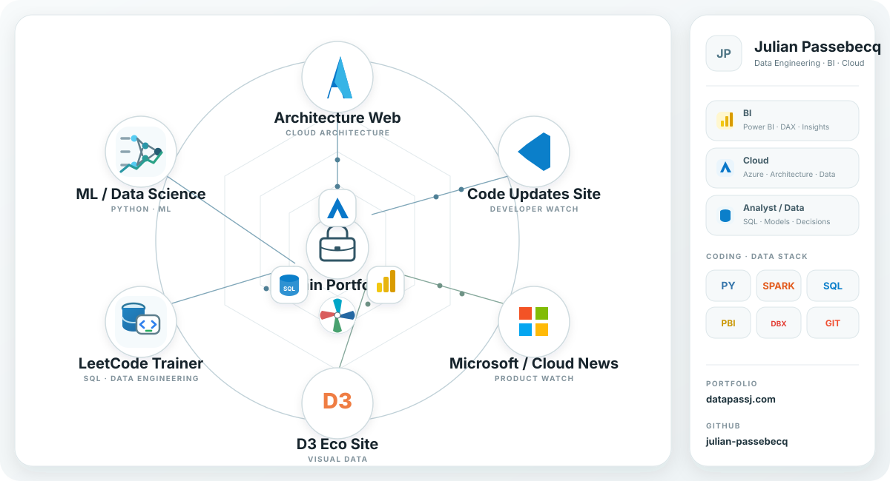

<h1 align="center">Julian Passebecq</h1>

  <b>Cloud BI Consultant</b> · Oslo, Norway

  <a href="https://datapassj.com/"><b>datapassj.com</b></a> ·
  <a href="https://datapassj.com/portfolio.pdf">Portfolio PDF</a> ·
  <a href="https://www.linkedin.com/in/julian-p95/">LinkedIn</a>

---

<h2 align="center">Analytics → BI · SQL → Cloud</h2>

  

Power BI · SQL · Fabric · Databricks · PySpark · Azure

 

<h3 align="center">GitHub snapshot</h3>

  
  

Repository activity and language mix from public GitHub projects.

---

<h2 align="center">Languages</h2>

  🇫🇷 <b>Français</b> · C1 &nbsp;&nbsp;|&nbsp;&nbsp;
  🇬🇧 <b>English</b> · C1 &nbsp;&nbsp;|&nbsp;&nbsp;
  🇳🇴 <b>Norsk</b> · B2

---

<h2 align="center">Certifications</h2>

<table align="center">
  <tr>
    <td align="center" width="70">
      
    </td>
    <td><b>PL-300</b> <a href="https://learn.microsoft.com/en-us/credentials/certifications/data-analyst-associate/">Power BI Data Analyst Associate</a></td>
  </tr>
  <tr>
    <td align="center" width="70">
      
    </td>
    <td><b>DP-600</b> <a href="https://learn.microsoft.com/en-us/credentials/certifications/fabric-analytics-engineer-associate/">Fabric Analytics Engineer Associate</a></td>
  </tr>
  <tr>
    <td align="center" width="70">🇳🇴</td>
    <td><b>Norsk B2</b> <a href="https://datapassj.com/norskb2.pdf">Certificate PDF</a></td>
  </tr>
</table>
